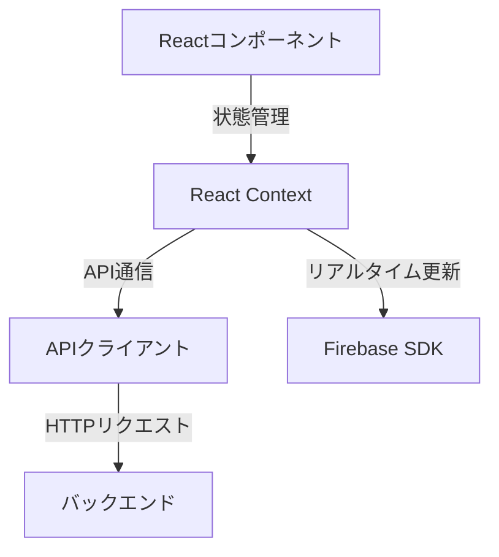
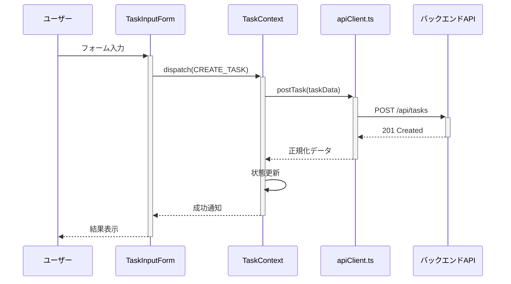
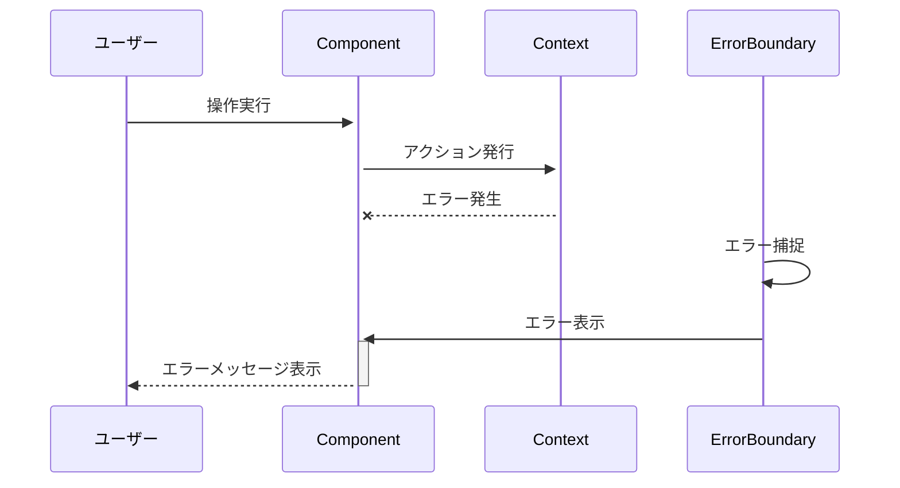

# クライアントアプリケーション シーケンス図ドキュメント

## 全体アーキテクチャ



## 主要ユースケースフロー

### タスク作成フロー



### 状態管理フロー

```mermaid
sequenceDiagram
    participant Component as 画面コンポーネント
    participant Context as AppContext
    participant Cache as ローカルキャッシュ
    participant API as APIクライアント

    Component->>+Context: データ要求
    alt キャッシュあり
        Context->>+Cache: データ取得
        Cache-->>-Context: キャッシュデータ
        Context-->>-Component: 即時表示
    else キャッシュなし
        Context->>+API: fetchData()
        API->>+Server: GET /api/data
        Server-->>-API: レスポンス
        API-->>-Context: 整形データ
        Context->>+Cache: データ保存
        Cache-->>-Context: 保存完了
        Context-->>-Component: データ表示
    end
```

## コンポーネント連携

### 認証フロー

```mermaid
sequenceDiagram
    participant User as ユーザー
    component LoginPage
    component AuthContext
    component FirebaseAuth
    component Router

    User->>+LoginPage: ログインボタンクリック
    LoginPage->>+AuthContext: signIn()
    AuthContext->>+FirebaseAuth: signInWithPopup()
    FirebaseAuth-->>-AuthContext: ユーザー認証情報
    AuthContext->>AuthContext: 状態更新
    AuthContext->>+Router: ナビゲーション
    Router-->>-User: ホーム画面表示
```

## パフォーマンス最適化

### データフェッチの最適化

```mermaid
sequenceDiagram
    participant Component as リスト画面
    participant Context as DataContext
    participant SWR[SWRキャッシュ]
    participant API

    Component->>+Context: useData()
    Context->>+SWR: キャッシュチェック
    alt 有効なキャッシュあり
        SWR-->>-Context: キャッシュデータ
        Context-->>-Component: 即時表示
    else キャッシュなし/無効
        Context->>+API: fetchData()
        API->>+Server: リクエスト
        Server-->>-API: レスポンス
        API-->>-Context: データ
        Context->>+SWR: キャッシュ保存
        SWR-->>-Context: 保存完了
        Context-->>-Component: データ表示
    end
```

## エラーハンドリング

### クライアント側エラーフロー



## コンポーネントライフサイクル

```mermaid
sequenceDiagram
    participant Parent as 親コンポーネント
    component Child
    participant Context
    participant DOM

    Parent->>+Child: マウント
    Child->>+Context: useContext()
    Context-->>-Child: 初期状態
    Child->>+DOM: レンダリング
    DOM-->>-Child: 完了
    Child-->>-Parent: マウント完了

    loop 状態更新
        Context->>Child: 状態変更通知
        Child->>DOM: 再レンダー
        DOM-->>Child: 更新完了
    end
```
