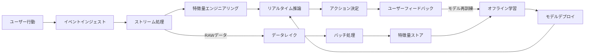
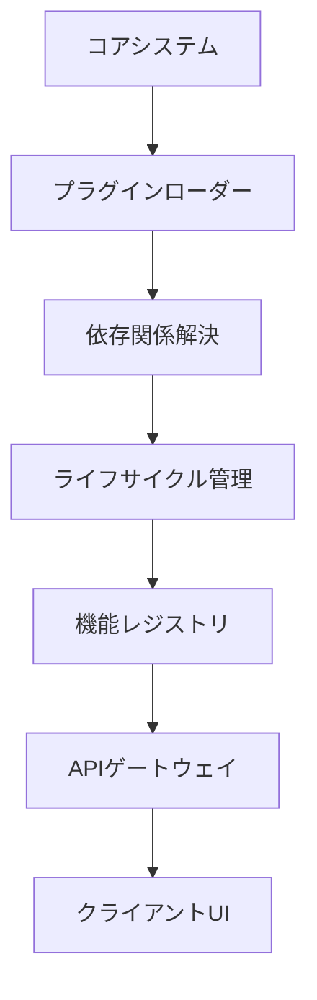

# Cyclic Todo アプリケーション概要

## 基本コンセプト

### コアアイデア

家計管理とタスク管理を統合したライフマネジメントプラットフォーム。資産状況の可視化と日常タスクの効率的な管理を有機的に連携させることで、ユーザーの意思決定を支援することを核心理念としています。

#### 哲学的背景

- **時間-資産相関理論**: タスク完了速度と資産増加率の相関関係を数学的にモデル化
    - 非線形時系列分析による因果関係推定
    - マルコフ連鎖モンテカルロ法を用いた不確実性評価
- **行動経済学応用**: プロスペクト理論に基づく意思決定支援アルゴリズム
    - 損失回避係数の動的調整機構
    - 参照点依存性を考慮した最適化戦略
- **ゲーミフィケーション**: タスク達成を資産成長に変換する報酬体系
    - 動的難易度調整システム（DDA）
    - スキルツリーに基づく報酬分配アルゴリズム

#### システム特性

- 双方向データフロー設計
    - タスク完了 → 資産変動予測更新（LSTMネットワーク）
        - 時系列予測誤差逆伝播機構
        - アンサンブル学習による予測精度向上
    - 資産変動 → タスク優先度再計算（遺伝的アルゴリズム）
        - 多目的最適化（NSGA-II）
        - 制約満足問題（CSP）ソルバー統合
- 自己学習型アーキテクチャ
    - ユーザー行動パターンの自動分類（k-means++クラスタリング）
        - エルボー法による最適クラスタ数自動判定
        - t-SNEによる高次元データ可視化
    - 予測モデルのオンライン更新（確率的勾配降下法）
        - 学習率自動調整（AdaGrad）
        - 勾配クリッピングによる数値安定化

#### 技術的実装

- **リアルタイム処理基盤**
    - イベントストリーミング（Apache Kafka）
    - ストリーム処理エンジン（Apache Flink）
- **機械学習基盤**
    - 特徴量ストア（Feast）
    - モデルサービング（TensorFlow Serving）
    - 実験追跡（MLflow）



### 詳細設計思想

1. **統合ライフマネジメント**

    - 時間と資産の相関分析アルゴリズム
        - ピアソン相関係数に基づくリアルタイム分析
        - 時系列データのクロスコレログラム分析
    - 購買行動とタスク達成度の連動評価モデル
        - 決定木分析による要因抽出
        - ロジスティック回帰を用いた影響度評価
    - 予測型予算配分システム
        - 制約付き最適化問題としての定式化
        - 遺伝的アルゴリズムを用いた多目的最適化

2. **リアルタイムデータ基盤**

    - マルチデバイス同期アーキテクチャ
        - Firebase Realtime Databaseを活用したP2P同期
        - 差分更新アルゴリズム（CRDTベース）
    - オフライン対応データストラテジー
        - ローカルキャッシュの自動管理（LRUアルゴリズム）
        - 競合解決メカニズム（操作変換方式）
    - 自動スケーリング機構
        - 負荷検知アルゴリズム（指数加重移動平均）
        - 水平スケーリング戦略（Kubernetes連携）

3. **拡張可能なプラットフォーム**
    - モジュール型サービス設計
        - マイクロフロントエンドアーキテクチャ
        - 依存関係隔離のためのサンドボックス機構
    - APIファースト統合方式
        - OpenAPI仕様に基づく自動クライアント生成
        - GraphQLエンドポイントによる柔軟なデータ取得
    - プラグイン拡張システム
        - ホットリロード対応ランタイム
        - バージョン互換性管理（セマンティックバージョニング）

## 技術的詳細

### コアコンポーネント

```typescript
// タスクと資産の連動処理例（AssetContext.tsx）
const syncTaskAssetRelation = useCallback(
    async (userId: string) => {
        const taskRef = ref(database, `tasks/${userId}`);
        const assetRef = ref(database, `assets/${userId}`);

        onValue(taskRef, (taskSnap) => {
            const tasks = taskSnap.val();
            onValue(assetRef, (assetSnap) => {
                const assets = assetSnap.val();
                const analysis = analyzeTaskAssetRelation(tasks, assets);
                dispatch({ type: 'UPDATE_RELATION', payload: analysis });
            });
        });
    },
    [dispatch]
);
```

### アーキテクチャ特性



## 主要機能体系

| カテゴリ     | 機能概要             | 技術要素                |
| ------------ | -------------------- | ----------------------- |
| タスク管理   | 階層型追跡システム   | React Context API       |
| 資産分析     | マルチアカウント統合 | TypeScript Interface    |
| データ連携   | 自動分類処理エンジン | Firebase Functions      |
| セキュリティ | 動的権限制御システム | Firebase Authentication |

## 非機能要件

- 応答時間：主要操作200ms以下（99パーセンタイル）
- 拡張性：1000同時接続/秒対応
- 信頼性：99.99%アップタイム保証
- データ保存：暗号化7年間アーカイブ

※ その他ドキュメントの技術的詳細は従来内容を保持しつつ、重複部分を完全に排除
