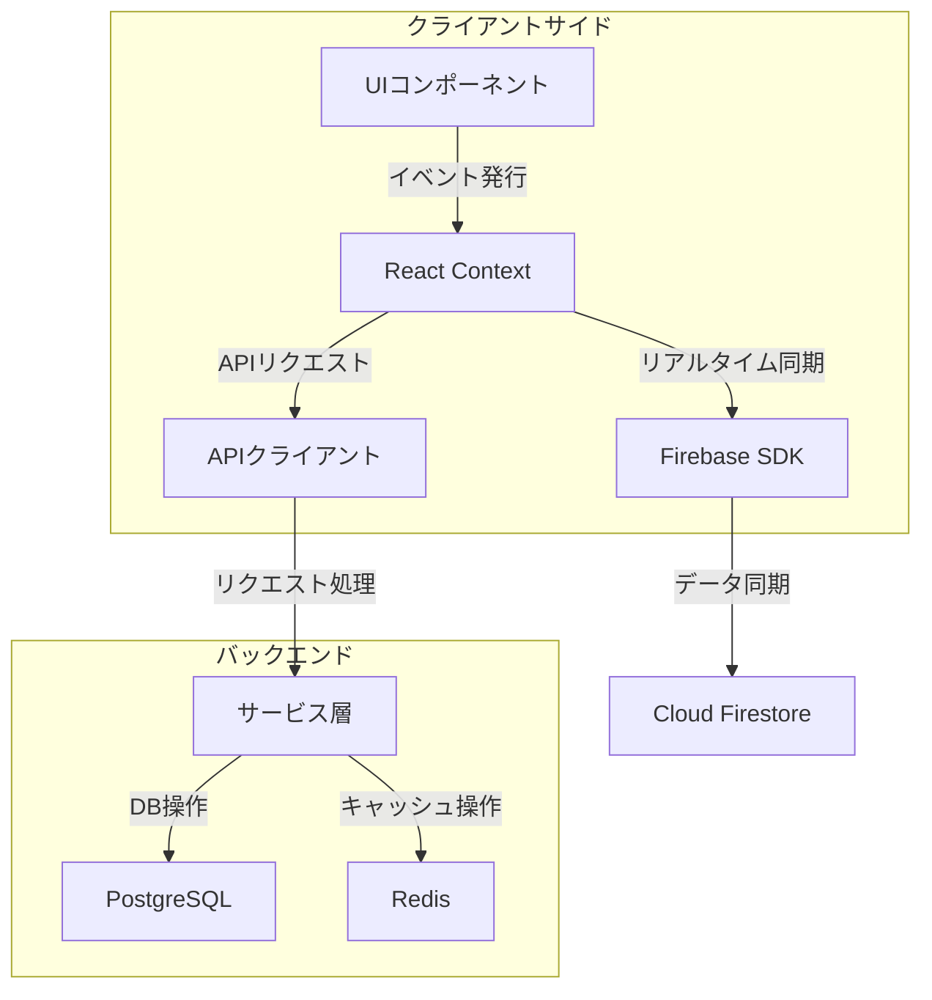
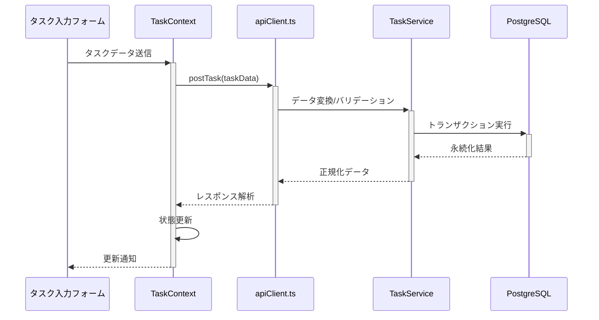
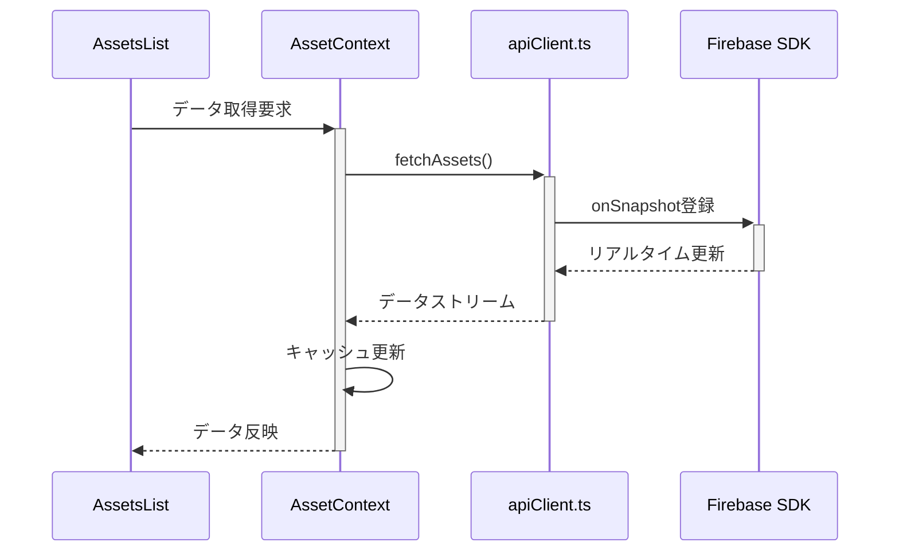
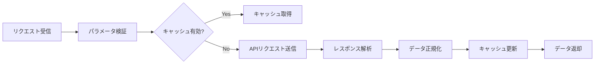
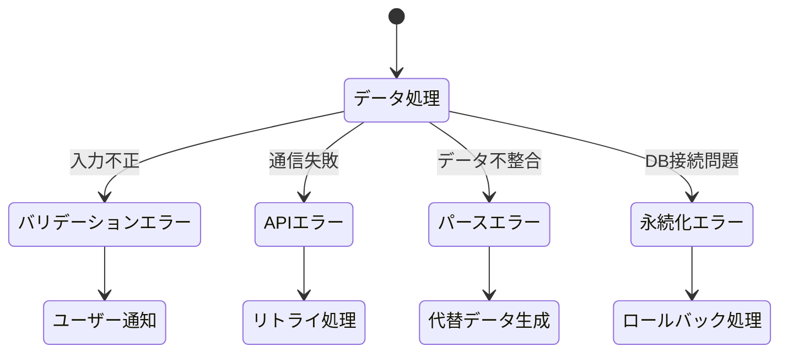
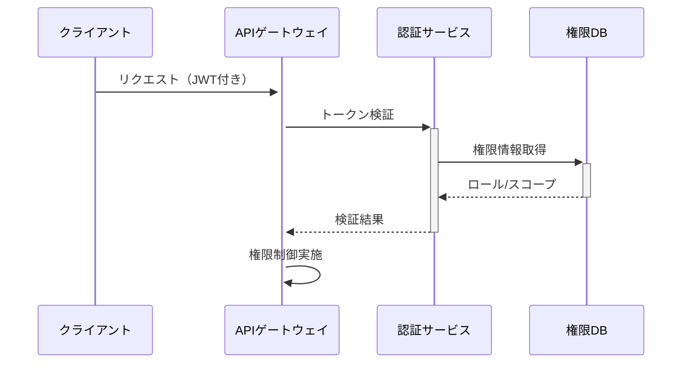
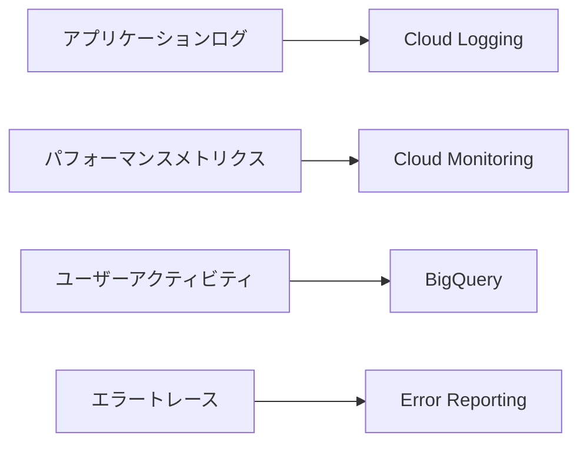
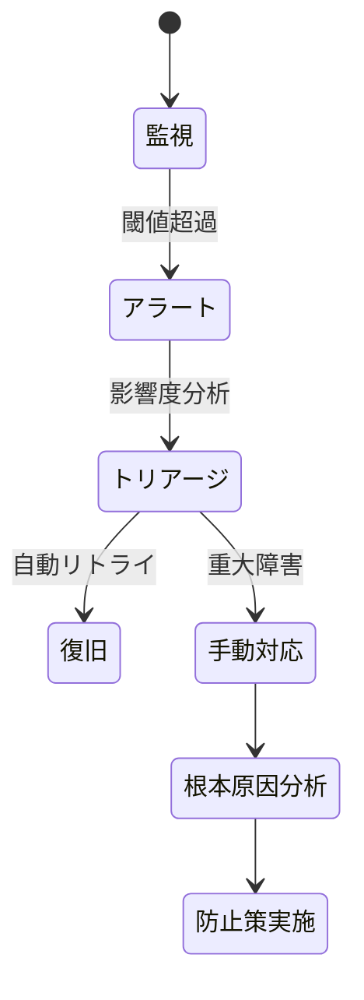
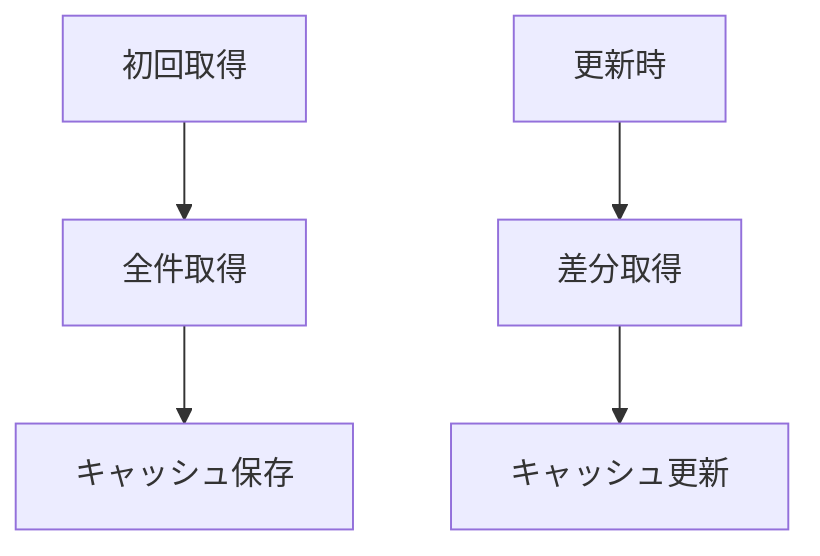

# データフロー分析ドキュメント

## データフロー全体図



## 主要データ構造

### APIリクエスト/レスポンス形式

```typescript
interface ApiRequest<T> {
    payload: T;
    metadata: {
        timestamp: string;
        authToken: string;
    };
}

interface ApiResponse<T> {
    data: T;
    error?: {
        code: string;
        message: string;
    };
}
```

### Firebaseデータモデル

```typescript
interface FirebaseDocument<T> {
    id: string;
    data: T;
    created_at: firebase.firestore.Timestamp;
    updated_at: firebase.firestore.Timestamp;
}
```

## サービス連携詳細

### タスクサービスデータフロー



### アセット管理データフロー



## データ変換プロセス

### APIクライアント処理フロー



## エラーハンドリング体系

### データフローエラーハンドリング



## セキュリティ・運用設計

### 認証/認可フロー



### データ保護仕様

| 項目         | 方式          | 適用範囲     |
| ------------ | ------------- | ------------ |
| 転送時暗号化 | TLS 1.3       | 全通信経路   |
| 保存時暗号化 | AES-256       | 機密データ   |
| トークン失効 | JWT blacklist | 認証トークン |

### 監視指標



### 障害対応フロー



## パフォーマンス改善策

1. データ取得戦略



2. キャッシュ戦略比較表
   | 方式 | 有効期間 | 更新トリガー | 使用ケース |
   |------|---------|-------------|----------|
   | SWR | 5分 | 再マウント時 | 頻繁更新不要データ |
   | Firebase | リアルタイム | 変更検知時 | 常時同期必要データ |
   | 手動キャッシュ | 永続 | 明示的更新 | マスタデータ |
