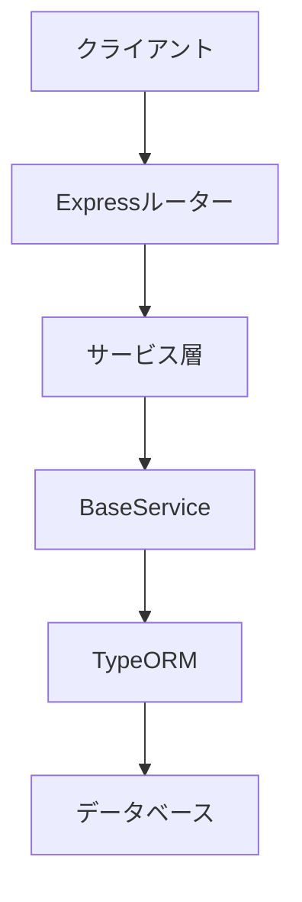
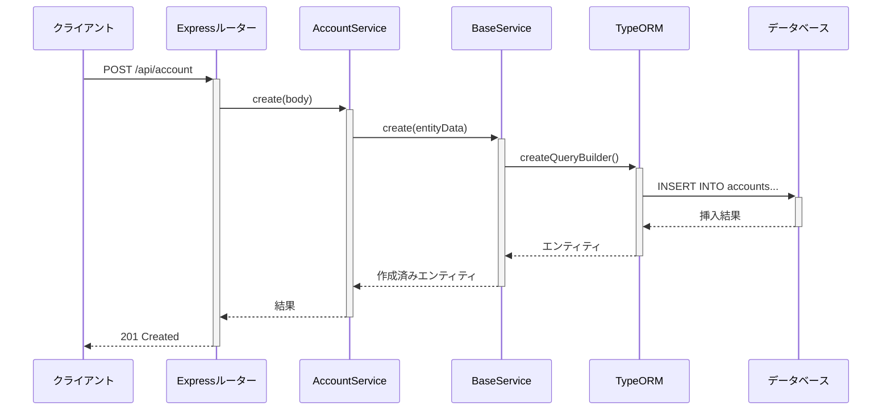
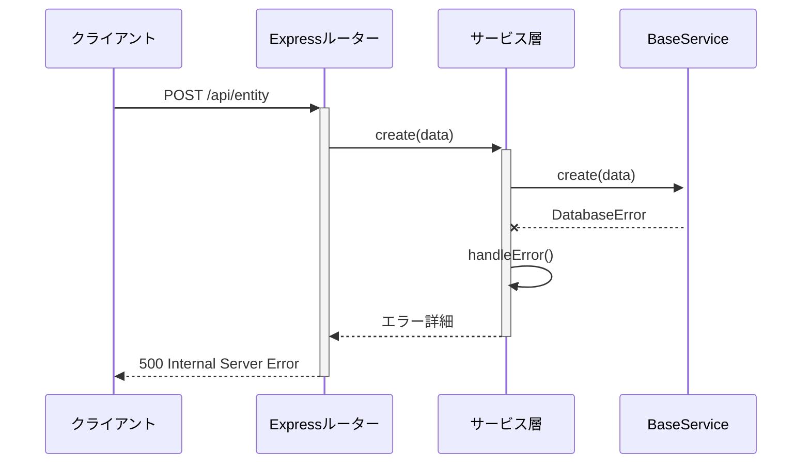
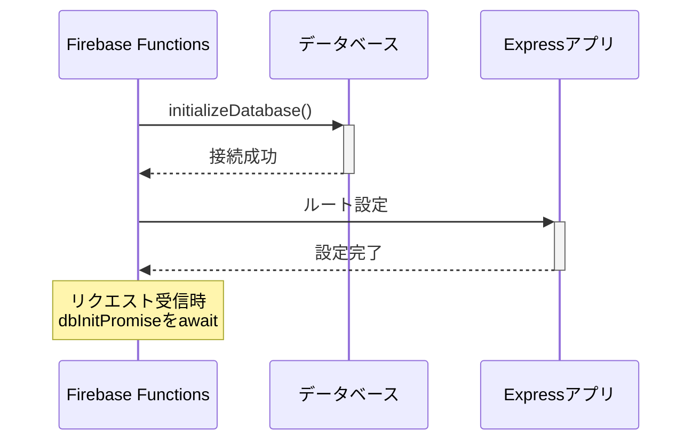
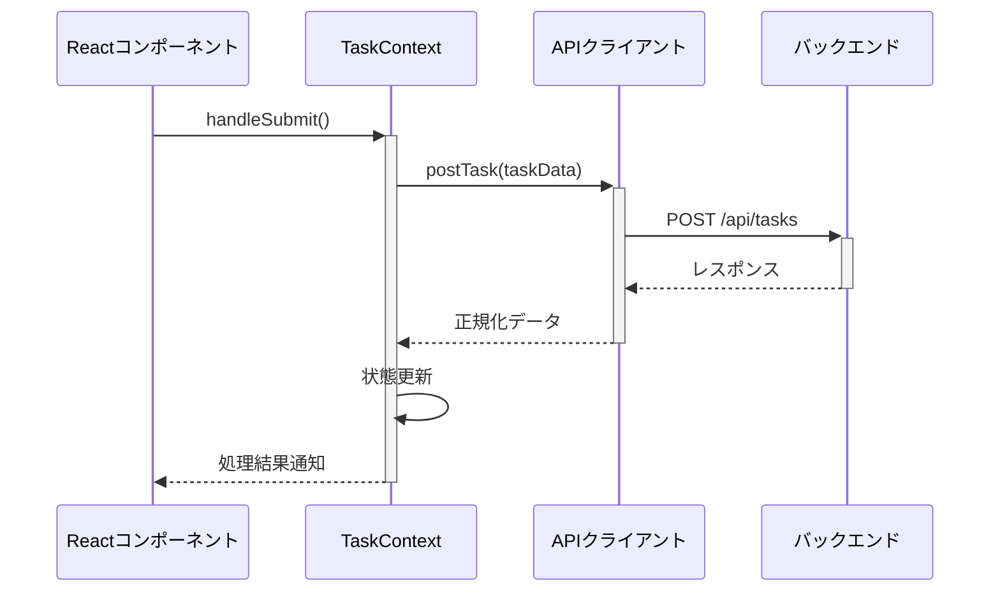
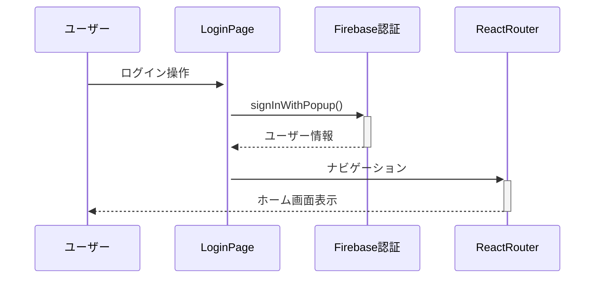
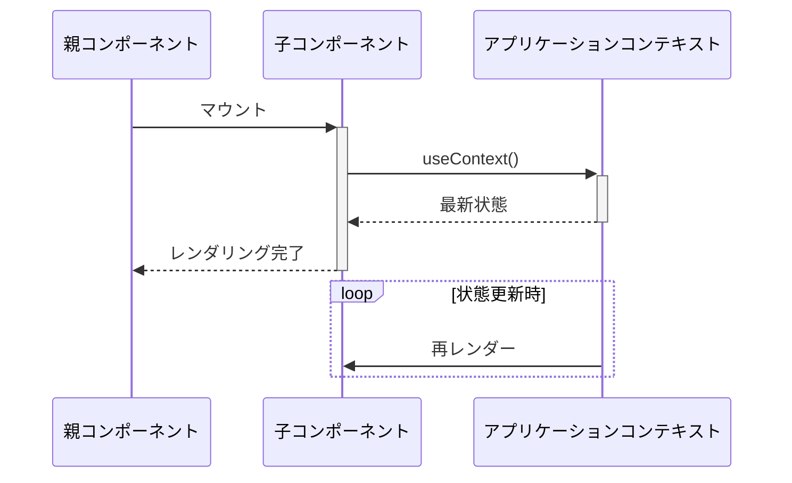

# サービス層シーケンス図ドキュメント

## アーキテクチャ概要



## 典型的なCRUD操作フロー

### アカウント作成（正常系）



### エラーハンドリングフロー



## 主要コンポーネントの責務

### Expressルーター

- APIエンドポイントの定義
- リクエストのバリデーション
- サービス層への処理委譲
- クライアントへのレスポンス返却

### サービス層（例：AccountService）

```typescript
class AccountService extends BaseService {
    // ドメイン固有のビジネスロジック実装
    async create(entityData) {
        // カスタムバリデーション
        return super.create(entityData);
    }
}
```

### BaseService

```typescript
abstract class BaseService {
    // 共通CRUD操作実装
    async create(entityData) {
        try {
            return await repository.save(entityData);
        } catch (error) {
            this.handleError('create', error);
        }
    }
}
```

## データベース初期化フロー



## 例外処理ポリシー

1. **データベースエラー**:

    - `DatabaseError`クラスでラップ
    - スタックトレース含めてログ出力

2. **ビジネスロジックエラー**:

    - `AppError`クラスで表現
    - クライアントに詳細を返却

3. **予期せぬエラー**:
    - グローバルエラーハンドラで捕捉
    - サニタイズしたメッセージを返却

## クライアント側シーケンス図

### タスク作成フロー



### 認証フロー



## コンポーネントライフサイクル


